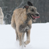
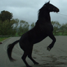
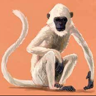
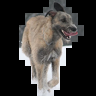
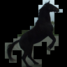
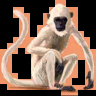

# STL10_Segmentation

Please consider sponsoring this repo so that we can continue to develop high-quality datasets for the AI/ML research.

To become a sponsor:

[GitHub Sponsors](https://github.com/sponsors/semihyagli) <br/>
[Buy me a coffee](https://buymeacoffee.com/semihyagli) <br/>

You can also sponsor us by downloading our free application, **_Etiqueta_**, to your devices:

[Etiqueta on iOS or Apple Chip Macs](https://apps.apple.com/us/app/etiqueta/id6504646776) <br/>
[Etiqueta on Android](https://play.google.com/store/apps/details?id=com.aidatalabel.etiqueta) <br/>


This repo contains segmented images for the labeled part of the [STL10 Dataset](https://www.google.com/url?sa=t&source=web&rct=j&opi=89978449&url=https://cs.stanford.edu/~acoates/stl10/&ved=2ahUKEwidyq31o9-LAxUQbvUHHeAOIx0QFnoECAgQAQ&usg=AOvVaw1TdzbOwKAoAz_-kLc5rghT). 

If you use this dataset in your research please do not forget to cite: <br/>

```
@techreport{yagli2025etiqueta,
  author      = {Semih Yagli},
  title       = {Etiqueta: AI-Aided, Gamified Data Labeling to Label and Segment Data},
  year        = {2025},
  number      = {TR-2025-0001},
  address     = {NJ, USA},
  month       = Apr.,
  url         = {https://www.aidatalabel.com/reports/TR-2025-0001.pdf},
  institution = {AI Data Label},
}
```
```
@inproceedings{coates2011analysis,
  title     = {An analysis of single-layer networks in unsupervised feature learning},
  author    = {Coates, Adam and Ng, Andrew and Lee, Honglak},
  booktitle = {Proceedings of the fourteenth international conference on artificial intelligence and statistics},
  pages     = {215--223},
  year      = {2011},
  organization={JMLR Workshop and Conference Proceedings}
}
```


Class | airplane | bird | car | cat | deer | 
--- | --- | --- | --- | --- | --- |
original  |  |  |  |  |  | 
segmented |  |  |  |  |  | 

Class | dog | horse | monkey | ship | truck | 
--- | --- | --- | --- | --- | --- |
original  |  |   |  |  |  | 
segmented |  |  |  |  |  | 


### Notes: 
'1495' 'cat_0' mark is in fact a 'dog_0'. <br/>
'6417' 'cat_0' mark is in fact a 'dog_0'. <br/>
'1718' 'cat_1' mark is in fact a 'dog_0'. <br/>
'1138' 'dog_1' mark is in fact a 'cat_0'. <br/>
'1484' 'dog_1', 'dog_2', 'dog_3' are in fact 'sheep_0', 'sheep_1', 'sheep_2'. <br/>
'6566' 'dog_0' and 'dog_1' marks are in fact 'cat_0', and 'dog_0'. <br/>
'7902' 'dog_0' and 'dog_1' marks are in fact 'cat_0', and 'dog_0'. <br/>