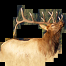

# STL10_Segmentation

Please consider sponsoring this repo so that we can continue to develop high-quality datasets for the ML/AI research.

To become a sponsor:

[GitHub Sponsors](https://github.com/sponsors/semihyagli)  
[Buy me a coffee](https://buymeacoffee.com/semihyagli)  

You can also sponsor us by downloading our free application, **_Etiqueta_**, to your devices:

[Etiqueta on iOS or Apple Chip Macs](https://apps.apple.com/us/app/etiqueta/id6504646776)  
[Etiqueta on Android](https://play.google.com/store/apps/details?id=com.aidatalabel.etiqueta)  

This repo contains segmented images for the labeled part of the STL10 Dataset. 

If you use this dataset in your research please do not forget to cite:  

Class | airplane | bird | car | cat | deer | 
--- | --- | --- | --- | --- | --- |
original  |  |  |  |  |  | 
segmented |  |  |  |  |  | 

Class | dog | horse | monkey | ship | truck | 
--- | --- | --- | --- | --- | --- |
original  |  |  |  |  |  | 
segmented |  |  |  |  |  | 

Notes: 
'1495' 'cat_0' mark is in fact a 'dog_0'.
'6417' 'cat_0' mark is in fact a 'dog_0'.
'1718' 'cat_1' mark is in fact a 'dog_1'.