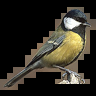

# STL10 - Segmentation

Please consider sponsoring this repo so that we can continue to develop high-quality datasets for the AI and ML research.

To become a sponsor:

[GitHub Sponsors](https://github.com/sponsors/semihyagli) <br/>
[Buy me a coffee](https://buymeacoffee.com/semihyagli) <br/>

You can also sponsor us by downloading our free application, **_Etiqueta_**, to your devices:

[Etiqueta on iOS or Apple Chip Macs](https://apps.apple.com/us/app/etiqueta/id6504646776) <br/>
[Etiqueta on Android](https://play.google.com/store/apps/details?id=com.aidatalabel.etiqueta) <br/>


This repo contains segmented images for the labeled part of the [STL-10 Dataset](https://www.google.com/url?sa=t&source=web&rct=j&opi=89978449&url=https://cs.stanford.edu/~acoates/stl10/&ved=2ahUKEwidyq31o9-LAxUQbvUHHeAOIx0QFnoECAgQAQ&usg=AOvVaw1TdzbOwKAoAz_-kLc5rghT).  <br/>
If you are looking for `STL10-Labeled` variant of the dataset, refer here: [STL10-Labeled](https://github.com/semihyagli/STL10-Labeled).<br/>
More information on the original STL-10 dataset can be found [here](https://cs.stanford.edu/~acoates/stl10/).<br/>
Thanks to Martin Tutek, the original STL-10 dataset can be downloaded via the python code in this [repo](https://github.com/mttk/STL10). For convenience, this code is copied in `stl10.py` in this repo.


If you use this dataset in your research please do not forget to cite: <br/>

```
@techreport{yagli2025etiqueta,
  author      = {Semih Yagli},
  title       = {Etiqueta: AI-Aided, Gamified Data Labeling to Label and Segment Data},
  year        = {2025},
  number      = {TR-2025-0001},
  address     = {NJ, USA},
  month       = Apr.,
  url         = {https://www.aidatalabel.com/technical_reports/aidatalabel_tr_2025_0001.pdf},
  institution = {AI Data Label},
}
```
```
@inproceedings{coates2011analysis,
  title     = {An analysis of single-layer networks in unsupervised feature learning},
  author    = {Coates, Adam and Ng, Andrew and Lee, Honglak},
  booktitle = {Proceedings of the fourteenth international conference on artificial intelligence and statistics},
  pages     = {215--223},
  year      = {2011},
  organization={JMLR Workshop and Conference Proceedings}
}
```

**Note: If you notice any errors and/or if you have comments/ideas relevant to this dataset or Etiqueta in general, please reach me out at [contact@aidatalabel.com](mailto:contact@aidatalabel.com).**

## Instructions

#### For Original Data:
You can download the stl10 image data by running 
```bash
python stl10.py
```
This will:
1. create a folder named `data` download and extract the stl10 dataset inside that folder. 
2. show one example picture in a new window.
<!-- 3. Once you close this example picture, images will then be saved under a folder called `img` -->
How to read images and their labels are also exemplified inside the `stl10.py`. For example, you can load all test images and their labels to a numpy array by using:
```python
import stl10

img_test_X_bin_loc = "./data/stl10_binary/test_X.bin"
img_test_y_bin_loc = "./data/stl10_binary/test_y.bin"

test_X = stl10.read_all_images(img_test_X_bin_loc)
test_y = stl10.read_labels(img_test_y_bin_loc)
```
Additionally, other useful functions are readily defined inside `stl10.py`. <br/>


#### For Segmentation Data:
Segmentation of each image in the `test_X.bin` file can be found inside the provided `.json` files. Note that images that contain more than a single segment are segmented using different labels. <br/>
The combined segmentations can be recovered running:

```bash
python recoverSegmentations.py 
```
By default, this will create `test_X_segmented.npy`, which contains the cutouts of images in the test part of stl10 as depicted in the examples before. 
- Depending on your device specifications, the above should take about *~10 minutes* to complete. The segmentation progress will be printed out so that you can go get a coffee while the segmented data is being saved. Feel free to modify the script depending on your needs.

 You can load this numpy array by using:
```python
from numpy import load 

DEFAULT_SEGMENTED_TEST_X_SAVE_LOC = "./test_X_segmented.npy"

test_X_segmented = load(DEFAULT_SEGMENTED_TEST_X_SAVE_LOC)
```
Observe that the arrays inside `test_X_segmented` are now sparse.

Enjoy!

## Examples

Class | airplane | bird | car | cat | deer | 
--- | --- | --- | --- | --- | --- |
original  |  |  |  |  |  | 
segmented |  |  |  |  |  | 

Class | dog | horse | monkey | ship | truck | 
--- | --- | --- | --- | --- | --- |
original  |  |   |  |  |  | 
segmented |  |  |  |  |  | 


### Notes: 
We have caught the following errors in the test part of the STL-10 dataset: <br/>

`1495`: `cat_0` mark is in fact a `dog_0`. <br/>
`6417`: `cat_0` mark is in fact a `dog_0`. <br/>
`1718`: `cat_1` mark is in fact a `dog_0`. <br/>
`1138`: `dog_1` mark is in fact a `cat_0`. <br/>
`1484`: `dog_1`, `dog_2`, and `dog_3` are in fact `sheep_0`, `sheep_1`, `sheep_2`. <br/>
`6566`: `dog_0` and `dog_1` marks are in fact `cat_0`, and `dog_0`. <br/>
`7902`: `dog_0` and `dog_1` marks are in fact `cat_0`, and `dog_0`. <br/>